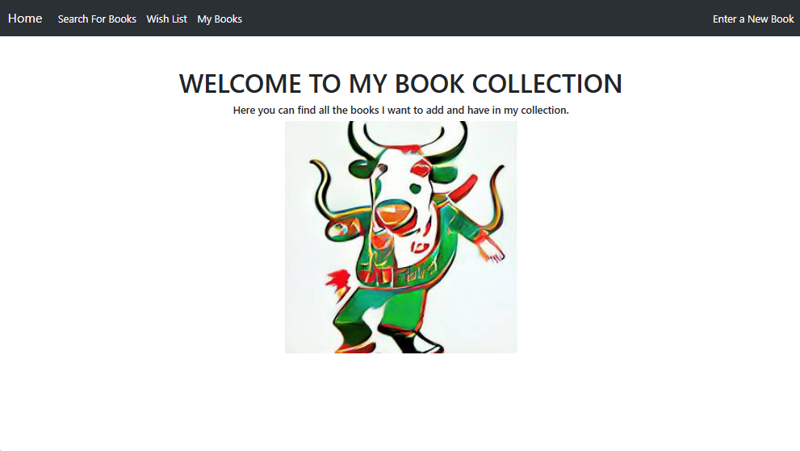

# Book Collection Web Application

## Overview

This project is a web application built using **Spring Boot** and **Thymeleaf** for server-side rendering. It allows users to perform simple lookups to the **OpenLibrary API** to find books, enter their own books to create a wish list, and manage their personal book collection. The application uses **MySQL** as the database to store book information and user-generated content.


## Features

- **Book Lookup**: Users can search for books using the OpenLibrary API by title.
- **Wish List Management**: Users can add books to their wish list for future reference.
- **Personal Book Collection**: Users can manage their own collection of books, including adding, editing, and deleting entries.
- **Responsive UI**: The application features a user-friendly interface that adapts to different screen sizes.

## Technologies Used

- **Spring Boot**: A framework for building Java-based web applications.
- **Thymeleaf**: A modern server-side Java template engine for web and standalone environments.
- **OpenLibrary API**: An API that provides access to a vast collection of book data.
- **MySQL**: A relational database management system used to store application data.

## Getting Started

### Prerequisites

- Java 11 or higher
- Maven
- An IDE (e.g., IntelliJ IDEA, Eclipse)

### Installation

1. Clone the repository:
   ```bash
   git clone https://github.com/clw237/bookCollections-ssr.git
2. Navigate to the project directory:
	```bash
	cd bookCollections-ssr
3. Configure your MySQL database:
	Create a new database (e.g., bookstore).
	Update the application.properties file with your MySQL connection details:
	```bash
	spring.datasource.url=jdbc:mysql://localhost:3306/bookstore
	spring.datasource.username=your_username
	spring.datasource.password=your_password
	spring.jpa.hibernate.ddl-auto=update
4. Build and run the project
	```bash
	mvn clean install
	mvn spring-boot:run
	
### Usage
- Open your browser and navigate to http://localhost:1001 to access the application.
- Use the navigation links to search for books, register new books, view available books, and manage your personal book list.